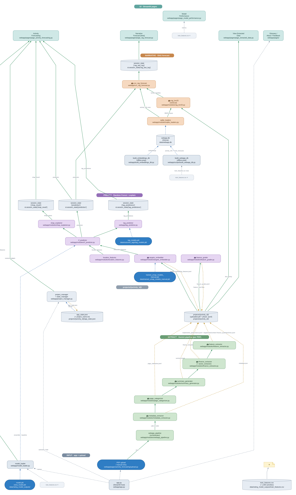

# codebase-diagrammer

**one-shot claude-opus-5, but useful**

A Claude Code skill that turns a repository into an editable draw.io diagram:
Claude reads the code and writes a graph JSON, Graphviz lays it out, and the
bundled scripts bake the positions and routed edges into a `.drawio` plus an
SVG and PNG. No draw.io application, no cloud service, no network access.

Nodes carry the file they stand for, so every box links to its source on GitHub
and every hover shows what that file actually does.



## Install

As a plugin:

```
/plugin marketplace add morganrivers/codebase-diagrammer
/plugin install codebase-diagrammer@codebase-diagrammer
```

Or drop the skill in by hand:

```
git clone https://github.com/morganrivers/codebase-diagrammer
cp -r codebase-diagrammer/skills/codebase-diagram ~/.claude/skills/
```

Then, in any repo:

```
/codebase-diagram
```

or just ask Claude to diagram how the repo fits together.

## Requirements

| requirement | needed for |
| --- | --- |
| Graphviz `dot` | layout |
| `defusedxml` | reading `.drawio` |
| `cairosvg`, or `rsvg-convert` / `inkscape` / `convert` | PNG only; SVG works without one |

```
python3 skills/codebase-diagram/scripts/check_deps.py
```

## Using the scripts without Claude

The pipeline is a normal command-line tool. Write a graph JSON by hand
(`skills/codebase-diagram/reference/graph-schema.md` documents every field,
`skills/codebase-diagram/examples/` holds a working one) and run:

```
python3 skills/codebase-diagram/scripts/build_diagram.py graph.json --render
```

`drawio_to_png.py` also stands alone: it renders any `.drawio` this generator
produced, in either plain or draw.io-compressed form, to SVG and PNG locally.

```
python3 skills/codebase-diagram/scripts/drawio_to_png.py diagram.drawio
```

## Layout

The graph JSON declares ordered **bands**, the stages one unit of work passes
through. The builder enforces them with an invisible node between each pair,
weighted so it fixes vertical order without dragging every band into a column.
Edges that run backwards against the band order, and external services feeding
several bands at once, are drawn but not allowed to set rank, so one return
arrow cannot invert the page.

## License

Public domain. See [LICENSE](LICENSE).
